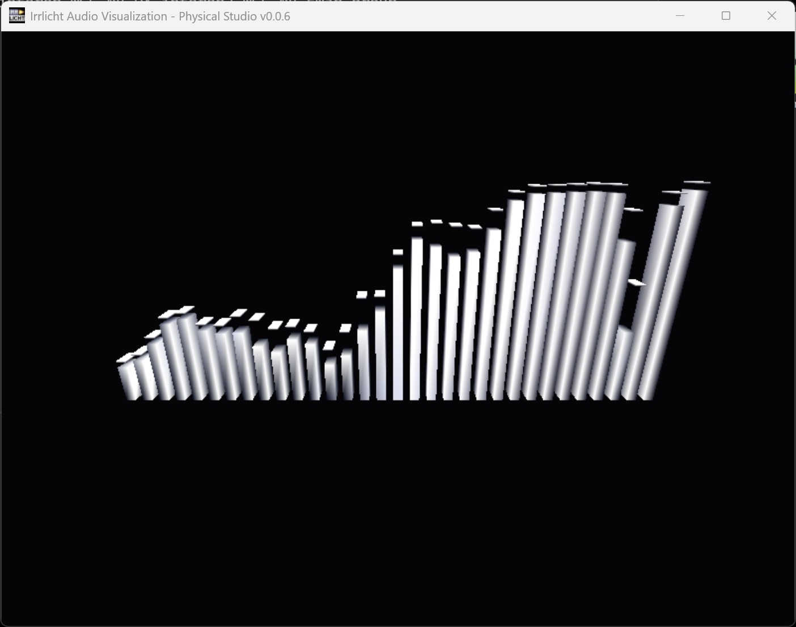

# MyIrrlicht

这是一个高度定制化的 **Irrlicht Engine** (v1.9) 分支。

> [!IMPORTANT]
> **Fork 说明**：本仓库并非官方镜像，而是专门为现代 Windows 环境下的 MinGW32 构建、音频回环捕获 (Loopback) 以及实时 3D 可视化而深度修改的版本。

---

## 🚀 核心修改 (Major Surgery)

相比于原始版本，本项目进行了以下核心改进：

### 1. MinGW32 工具链稳定性修复
- **构建适配**：修复了在 Windows 10/11 环境下使用 `i686-w64-mingw32` (MinGW-w64) 编译 Irrlicht 静态库时的导出符号与链接错误。
- **DirectX 兼容性**：优化了针对 MinGW 的 DirectX 头文件路径处理。

### 2. 原生 WASAPI 音频桥接 (Audio Bridge)
- **回环捕获**：集成了一套基于 **Windows WASAPI** 的底层音频回环捕获驱动 (`wasapi_bridge.c`)，由于无需安装虚拟声卡即可直接分析系统输出声音。
- **高性能流处理**：实现了无损环形缓冲区读取，支持 16-bit PCM 立体声实时采集。
- **音量增强**：内置数字增益 (Gain Boost) 与防爆音裁剪逻辑。

### 3. 项目空间模块化 (`/projects`)
- 引入了独立的 `/projects` 目录，将用户开发代码与引擎源码解耦，方便快速迭代。

---

## 🏗️ 快速开始

### 环境要求
- **编译器**: MinGW-w64 (32-bit 版，推荐 `i686-w64-mingw32-g++`)。
- **构建工具**: `mingw32-make`。

### 编译引擎
在根目录下执行：
```bash
# 自动通过 MinGW32 编译静态库与 DLL
mingw32-make win32
```

### 运行示例：音频可视化
进入示例项目目录：
```bash
cd projects/SimpleAudioVisual
mingw32-make all_win32
# 成功后在 bin/Win32-gcc 下运行 SimpleAudioVisual.exe
```

---

## 🎨 工程图鉴 (Project Gallery)

详见 [/projects](/projects) 目录下的各个实验。

### 1. SimpleAudioVisual (音频频谱可视化)
基于音频驱动的高表现力物理频谱可视化系统。

- **核心算法**：采用非线性双曲正切 (`tanh`) 渲染量程映射，实现“软限幅”视觉，彻底解决动态触顶问题。
- **高频补偿**：具备指数级高频权重调节（`HF_Tilt`），精准掌控频谱两端的能量表现。
- **物理特效**：模拟真实重力感应的峰值（Peak）下坠物理模型。

#### 视觉预览


---

## 📜 鸣谢
- **Original Engine**: [Irrlicht Engine Team](http://irrlicht.sourceforge.net/)
- **Customized by**: Yifan Shen · SharpEye

## ⚖️ 许可
本项目沿用 Irrlicht Engine 原有的 zlib 许可协议。
